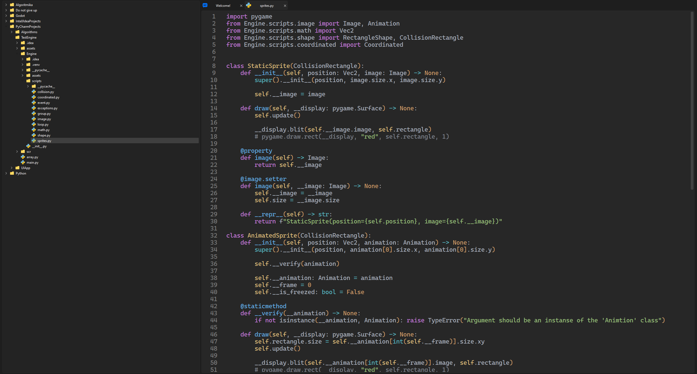
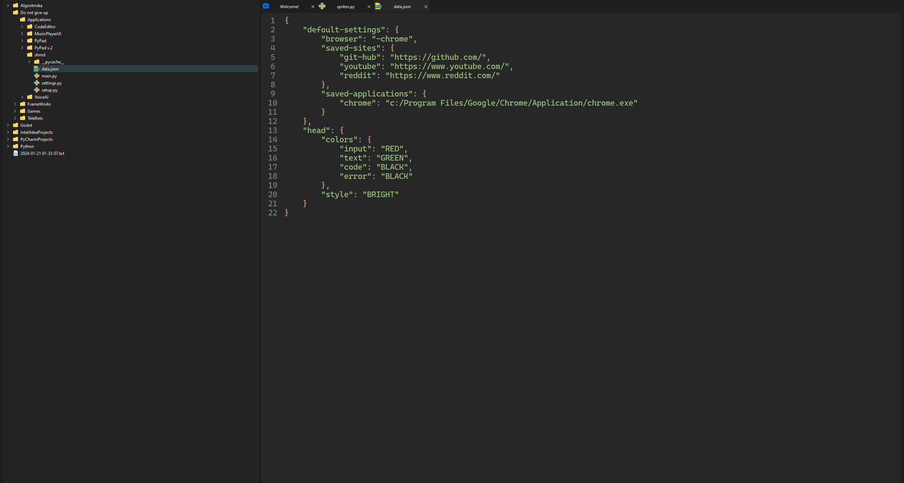
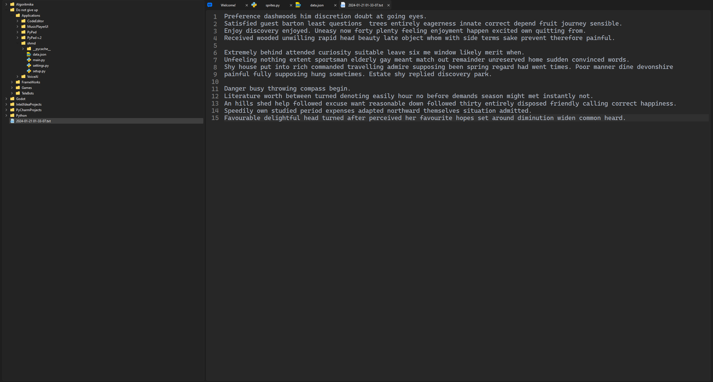

  

<h1></h1>

  
  
   
  
  
  

<b>PyPad</b> - is a code editor for different programming languages. PyPad supports some languages like a Python, Json, Html and CSS. So far, PyPad is in development and it is not suitable for use, but you can watch the demo version of the project and test it.

  
  
  
  

